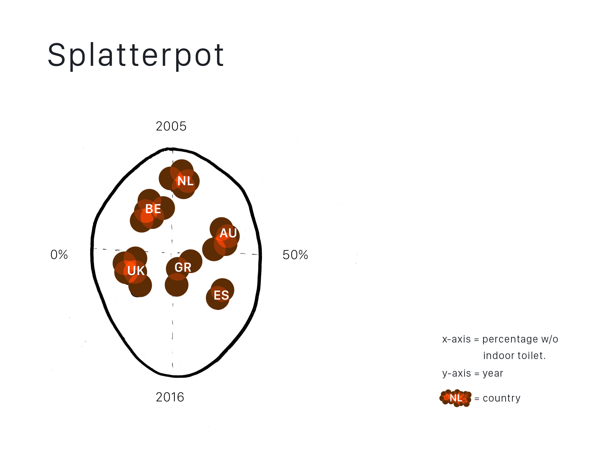

# ![Assessment 1][banner]

A visualization for [FE3 Assessment 1](https://github.com/cmda-fe3/fe3-assessment-1) by @danoszz. This documentation will show my process and thoughts.

## Initial Idea

As the [workflow](https://github.com/cmda-fe3/fe3-assessment-1#workflow) guided through the process; a visualization always will start with looking at the raw data. I chose the [Population without indoor toilet dataset](https://github.com/danoszz/course-17-18/tree/master/assessment-1#population-without-indoor-toilet) in particular because of a few reasons:

* In the past I had some problems with JSON formats for visualizations, good time to learn.
* Most data points from each dataset: year, percentage and country.
* 💩

I came up with an _initial idea_ of creating a [scatterplot](http://bl.ocks.org/weiglemc/6185069) in the shape of an toilet called ***Splatterpot***.

#### Scope

Since the idea is a bit out of scope for the project and above my own expectations it is fair to say the outcome would never match 100% with the _initial idea_. I've learned that if I focus to much on the style, concept en outcome that the code will be the weak chain in the end-product. To match the [learning objectives](https://github.com/cmda-fe3/course-17-18#subgoals) the visualization is focused on a working D3.js code instead of a laughable, not working, toilet with 💩. So therefore styling is out of scope (but not out of mind).

#### Failed

But.. I failed to deliver it before the deadline because I was stuck at one point for 5 hours:

* The 'years' (2005 - 201^) are stored in JSON as same level as 'country' and 'code' and as a string. To get them on the Y-axis was impossible.

## Kill your darlings

One and a half hour before the deadline I realized I had to make a big change to still hand in a proper working code. So I did. It needed to be ***fast*** and ***solid***. So no crazy ideas. They can be handed in during the re-sit at the end of the semester. The original code can be viewed [here](scripts/app_splatterplot.js).

> ✂️ The only challenge for myself to write the code as in few lines as possible.

### Features

Although I am not 100% happy with the result the D3.js visualization contains a decent amount of features:

* d3.pack
* d3.tsv
* d3.format
* d3.hierarchy

The prettified code is only ***48 lines*** long!

#### Things that had to be done

*   [x] Pick another [dataset](https://github.com/danoszz/course-17-18/tree/master/assessment-1)
*   [x] Find a [example code](blocksrepo) for visualization
*   [x] Clean up file structure and make it work locally
*   [x] Again some cleaning, but now in the HTML, CSS and most importantly JS
*   [x] Change D3 V3 to D3 V4
*   [x] Get a working visualization without any errors
*   [x] Upload master branch to GitHub Pages
*   [x] Edit meta data
*   [x] Workflow described in documentation and code
*   [x] Replace this document in your fork with own readme!
*   [x] ES5 -> ES6
*   [ ] Add functionalities (ex. hover display amount, force & drag function)
*   [ ] Style the hell out of this boring bubble chart

[banner]: assets/images/preview-image.png

[blocksrepo]: https://bl.ocks.org/mbostock/4063269
